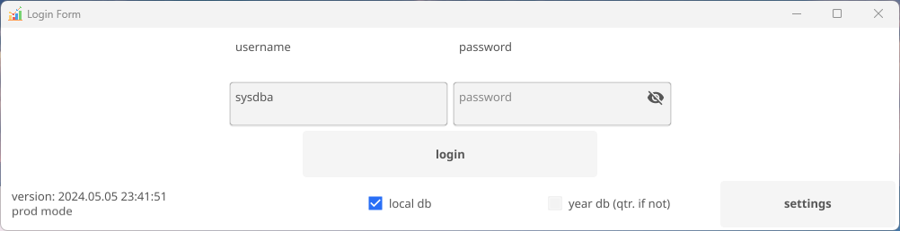
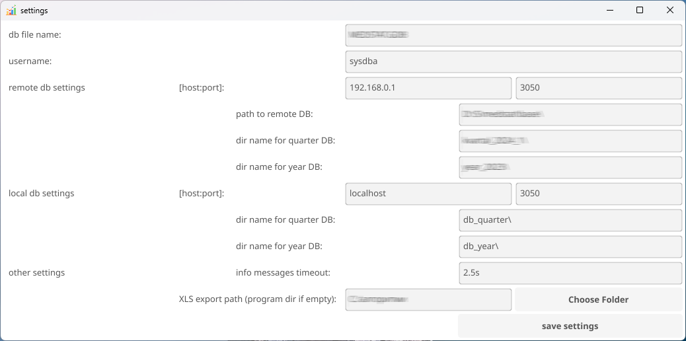
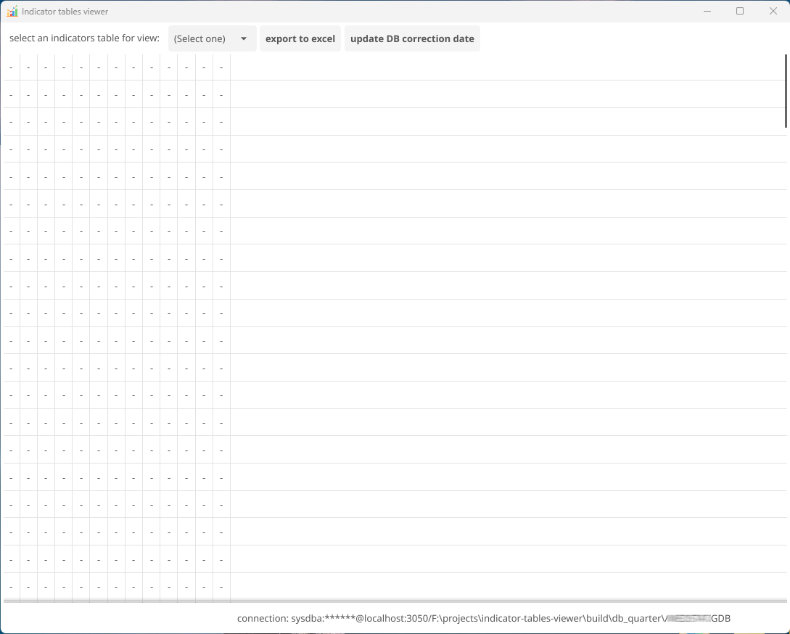

## Table of Contents

- [Screenshots](#screenshots)
- [Running the program](#running-the-program)

## Screenshots

## Running the Program

To run the program:

1. Ensure that the CFG_PATH environment variable is set or specify the CFG_PATH flag.
   The flag specifies the path to the config file as follows: --CFG_PATH=config.toml 
2. Execute launcher.exe.

The launcher automatically checks for updates and updates the program if necessary.
Auto-update is enabled if 'auto_update' is set to 'true' in the config.toml file.
After checking for updates, the launcher.exe executes viewer.exe using the CONFIG_PATH environment
variable, which is equivalent to the CFG_PATH flag or CFG_PATH environment variable specified
at launcher startup.